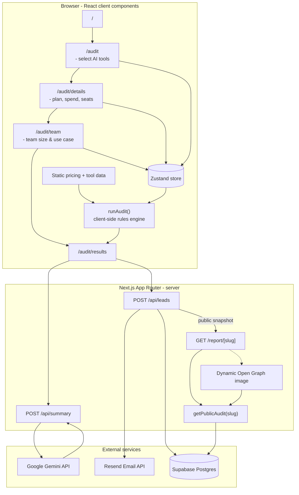

# SYSTEM DIAGRAM



  # DATA FLOW

## 1. Audit Input Collection

The user progresses through a multi-step onboarding flow where they select:

- AI tools currently in use
- Existing plans/subscriptions
- Team size
- Primary use case

This data is stored in a global Zustand store so state persists across onboarding screens.

---

## 2. Audit Engine Processing

Once onboarding is completed, the results page calls the `runAudit()` engine.

The audit engine:

- Reads the selected tools and pricing inputs
- Normalizes spend across different plans
- Detects overlapping subscriptions
- Applies optimization rules
- Calculates monthly and annual savings
- Generates recommendation objects with reasoning

The recommendation system is deterministic and rule-based to keep savings calculations explainable and consistent.

---

## 3. AI Summary Generation

The generated recommendations are sent to:

```
POST /api/summary
```

This API route:
- Sends recommendation data to Gemini
- Receives a concise optimization summary
- Returns the generated summary to the frontend

If the LLM request fails, the application falls back to a templated summary.

---

## 4. Lead Capture

When the user saves the audit:
Lead information is submitted to:

```txt
POST /api/leads
```

The route:

- Validates the request
- Runs honeypot protection
- Stores lead information in Supabase
- Creates a public-safe audit snapshot
- Generates a shareable slug URL
- Sends a transactional email through Resend

---

## 5. Public Report Generation

The generated url routes to:

```txt
/report/[slug]
```

This page:

- Fetches the public audit snapshot
- Renders the recommendations
- Generates dynamic metadata
- Generates dynamic Open Graph preview images for social sharing